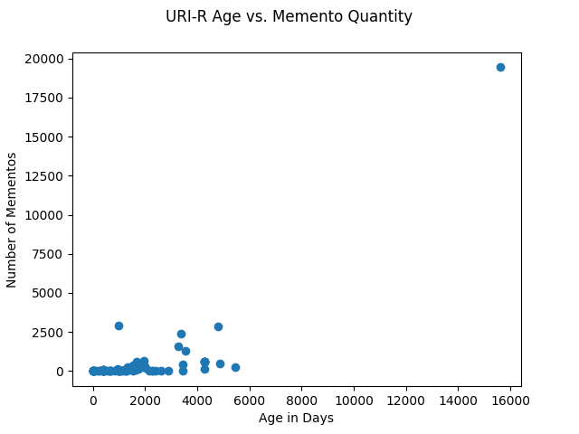
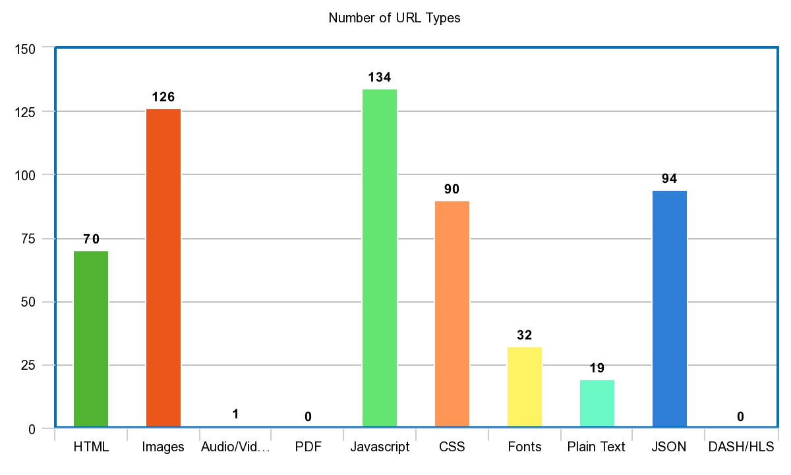

# Twitter API Tweet Gathering With Link and Memento Processing

I used collect-tweets.py to collect tweets, ran the tweets through process-tweets.py to get the expanded urls from each tweet, saved the expanded urls in expanded-urls.jsonl, and made process-urls.py to make a HTTP request for each expanded url to get the final uri, saved in final-uris.jsonl. This is a reupload of a project done in 2022 for a Python coding course with all references to course material removed. This project was completed when X was still known as Twitter. All graphs except the "Number of URL Types" bar graph were created using Matplotlib. "collect-tweets.py" and "process-tweets.py" were partially provided by the professor.

## Explanation and Reasoning

Below, I explain my thoughts and reasoning while working through this project.

### Script order:
1. collect-tweets.py
2. process-tweets.py
3. get-timemaps.py
4. process-timemaps.py
5. process-urls.py

Expanded-urls and final-uris do not need to be .jsonl files due to only having a single website link per line, but the original tweets.jsonl file was a .jsonl file and I found myself making my other files the same way unnecessarily. Them being .txt files would make no difference.

For some reason, collect-tweets.py did not want to run if I changed MAX_TWEETS to a value > 100. I ended up using a lot of different search terms to get enough tweets for ~1000 total final-uris, which ended up being 4732 tweets. I ended up only making minor changes to process-tweets.py by making the file open tweets.jsonl directly and having it output links into expanded-urls.jsonl. I used this same input file and output file idea to make process-urls.py.

While I was running expanded-urls.jsonl through process-urls.py, my file kept stopping without terminating and giving an error code or timing out during a HTTP request. I checked the url that was causing the file to freeze while running, which was https://bit.ly/10t-thm2. Checking https://bit.ly/10t-thm2+ which allows you to preview what a bitly link points to gave me https://stream.zeno.fm/8t93555zm0hvv. I didn't open the link to try to figure out why it was causing problems incase the link was dangerous.

Since I had to keep getting more tweets with collect-tweets.py to work towards getting 1000 final uris, I wanted a way for process-urls.py to be able to run without having to delete final-uris.jsonl every time. I did this by adding the existing URIs in final-uris.jsonl to a set of seen URIs to compare each final URI from a successful HTTP request to. Adding to the set of seen URIs whenever a new URI was returned from a request allowed me to not save duplicate URIs at the same time. I stopped Twitter links and some websites that likely only have video/audio from being saved with a simple regex, which allowed me to check for matches twice - once before making a request and once after. This stopped some unnecessary requests from being made that wouldn't end up being saved anyway.

```Python
excludes = re.compile("twitter\.com|youtube\.com|twitch\.tv|oundcloud\.com|imgur\.com")
if(excludes.search(url) != None):
  continue
```

I obtained the [TimeMaps](http://www.mementoweb.org/guide/quick-intro/) for each of the unique URIs from Q1 using the ODU Memento Aggregator, [MemGator](https://github.com/oduwsdl/MemGator).   

I created get-timemaps.py to run the MemGator command for each URI through Powershell and saved a separate .json file for each URI in the timemaps folder. 

Figuring out how to get the timemaps for each URI took a deceptive amount of time for the short length of get-timemaps.py. I decided to make a Python script to run my MemGator commands, which required me to first figure out how to make the Memgator command I wanted through Powershell before then having to figure out how to make Python run the Powershell command I wanted. After testing different return formats and values of top k archives, I decided on only checking the top 3 archives and JSON output format after my second URI returned thousands of mementos. I wanted to try to make the returned JSON into a .jsonl file for continuity, but couldn't find a clean way to do it and ended up making .json files.

I originally wanted to name each .json file *website URI*.json, but the names ended up not being viable due to length or other issues. The .json files ended up just being numbered. This isn't the biggest problem since returned timemaps have the original URI at the top, but if you want to know what URIs returned nothing then there is no way to check.

I found a way to make a command through Powershell using the *subprocess* library, but a majority of my time spent on question 2 was spent getting my subprocess to run.

```Python
import subprocess
output = open("timemaps/{}.json".format(i), "w")
timemap = subprocess.run(["powershell.exe", "-Command", cmd], stdout = output, stderr = sys.stderr)
output.close()
```

The "powershell.exe", "-Command" variables tell subprocess to run a powershell command. Particularly, -Command allows you to pass a string through that holds your entire command. While fixing errors with get-timemaps.py, I had to remove the newline character from the URI that was read from final-uri.jsonl. I also ran into problems with ampersands in website URIs, which Powershell takes as a command and not part of the website link. The way to fix this is by using single quotes around the whole command string and double quotes around the website link in the command, but I usually use double quotes by default. I'll try to remember to use single quotes by default from now on. stdout = output sends the result of the command to my output file.

|Mementos | URI-Rs |
|---------:|--------:|
|   0     |  972   |
|   1-50     |  56   |
|   51-100     |   15   |
|   101-500     |   15   |
|  501-1,000     |    7   |
|  1,001-3,000     |    5   |
|  19,434     |    1   |

I had 6 URIs that returned over 1000 mementos. The URIs were, in increasing order of Mementos:

|URI-R | Mementos |
|---------:|--------:|
|   https://www.gofundme.com/     |  1,319   |
|   https://telegram.org/     |  1,611   |
|   https://www.nbcnews.com/     |   2,377   |
|   https://www.thetimes.co.uk/     |   2,847   |
|  https://www.worldometers.info/coronavirus/     |    2,902   |
|  https://www.google.com     |    19,434   |

The URI-Rs with the most mementos don't surprise me at all. They are all hub websites with a lot of traffic and many links to other webpages. Not deciding to limit the Memgator command to only check the top 3 archives would have likely allowed google.com to return an insanely large number of mementos.

To get the values to make the tables above, I made process-timemaps.py.

I checked 1071 URIs. 972 did not return a timemap and 99 did return a timemap. I started by looking at the first URI that returned a timemap, which was https://www.worldometers.info/coronavirus/ with 2,902 mementos, and worked on part of question 4 at the same time, namely getting the earliest datetime. To get the earliest datetime I planned on getting and comparing `data['mementos']['list']['datetime']` between multiple entries in `['memento']['list']`, but couldn't access datetime. I eventually found out that this was due to datetime and uri being a dictionary nested inside of a list, and after looking at the first URI that returned a reasonable number of mementos (8), I realized that I could just use the already-available `['first']['datetime']`. The data used to answer question 3 was printed to the console.



It is not so visually obvious with my dataset, but there is a correlation between the age of a URI-R and its number of mementos. It is likely that the poor reflection of this correlation in my dataset is due to my search terms when gathering tweets and limiting Memgator to only the top 3 archives, as well as google.com's number of mementos being so far ahead of the second most.

The URI-R with the oldest memento, by index, was 1048 or https://www.google.com with 19,434 mementos. If I had to guess what website had the most mementos, my first guess would be Google.

I only had 5 URI-Rs that had an oldest memento with an age less than 1 week. 

I added to the end of process-timemaps.py to get the rest of the data I needed to create a scatterplot using matplotlib.pyplot. To use pyplot to make a scatterplot, I needed to convert get the age of each oldest memento and convert that datetime type variable into something that matplotlib could use. Once I got the datetime from the json file which was of type string converted to type datetime, I was able to subtract that date from the current date to get the age of the oldest memento as a type timedelta. Once I had the age, I had to find a way to convert the age into a value that matplotlib could use. I found that datetime had a method to get the length in seconds of a timedelta, and eventually realized that I could divide that number by the number of seconds in a day to get the age in days.

From there, I checked the matplotlib documentation for the additional functions I needed to make and save my scatterplot with a title and axis titles.



## Tools Used:

- Python
	- Subprocess
	- Matplotlib
- Twitter API
- MemGator

## References

https://www.easytweaks.com/python-remove-newline-string/

https://stackoverflow.com/questions/1215208/how-might-i-remove-duplicate-lines-from-a-file

https://ourtechroom.com/tech/open-ampersand-containing-url-with-start-command/

https://www.phillipsj.net/posts/executing-powershell-from-python/

https://www.codingem.com/python-how-to-quote-a-string/

https://www.folkstalk.com/2022/09/pycharm-remove-tab-for-multiple-lines-with-code-examples.html

https://docs.python.org/3/library/subprocess.html

https://stackoverflow.com/questions/29281935/what-exactly-does-the-t-and-z-mean-in-timestamp

https://stackoverflow.com/questions/50405953/how-to-count-nested-json-objects-from-a-nested-array-in-python

https://www.geeksforgeeks.org/read-json-file-using-python/

https://realpython.com/visualizing-python-plt-scatter/

https://docs.python.org/3/library/re.html

https://www.geeksforgeeks.org/python-sort-list-according-second-element-sublist/

https://www.digitalocean.com/community/tutorials/python-string-to-datetime-strptime

https://www.programiz.com/python-programming/datetime/current-datetime

https://stackoverflow.com/questions/2238008/subtract-two-dates-to-give-a-timedelta

https://docs.python.org/3/library/datetime.html

https://stackoverflow.com/questions/69774299/typeerror-float-argument-must-be-a-string-or-a-number-not-datetime-timedelt

https://matplotlib.org/stable/api/pyplot_summary.html
